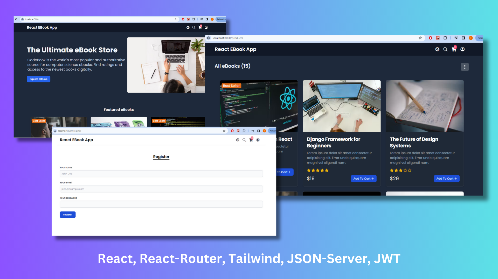

# React eBook Application

## Features
- Register / Login
- Ebooks listing
- Filter and Search
- Add to Cart
- Place order
- Order history page

## Local Dev Setup
- Create `.env` file with `REACT_APP_HOST=http://localhost:8000`, this is the API URI hosted using json-server and json-server-auth
- `npm start` to start the dev server
- `npm run server` to run the json-server and json-server-auth

## Notes
- How to create a modularized project structure with all the API's in services fold
- Use of different hooks such as `useState`, `useEffect`, `useReducer`, `useContext`, etc
- Custom hooks
- React Router
- Tailwind CSS
